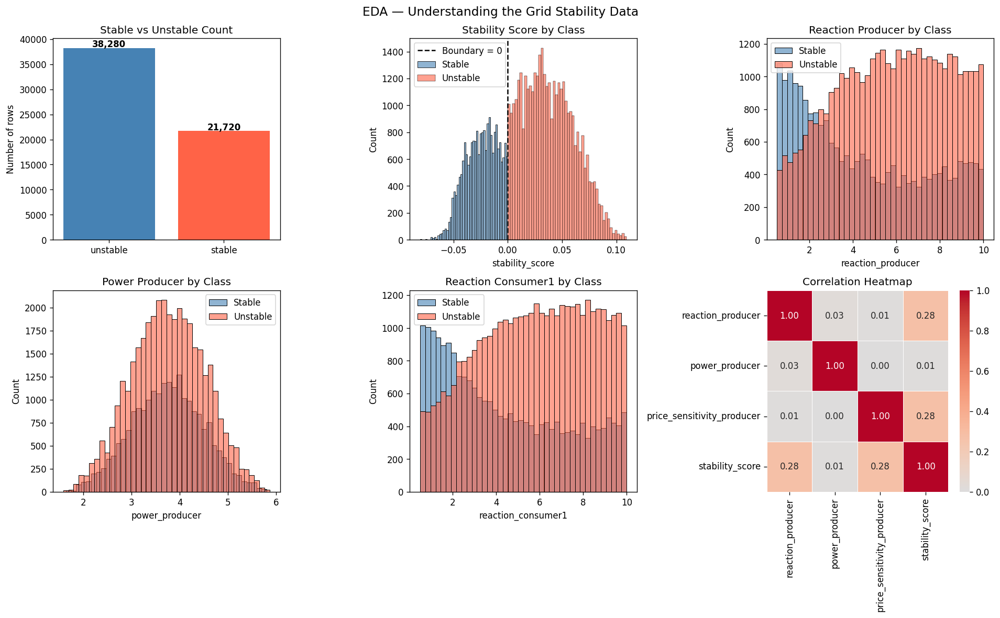
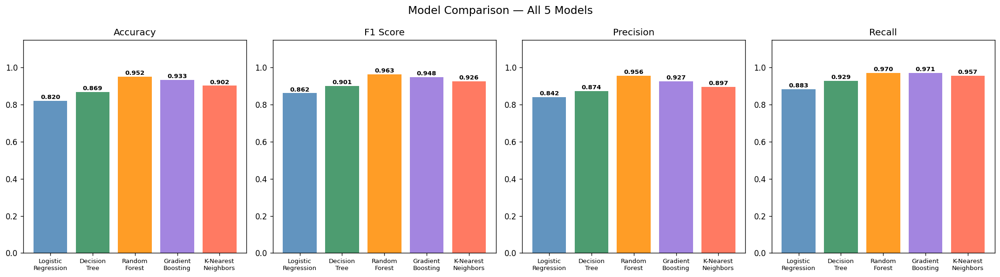
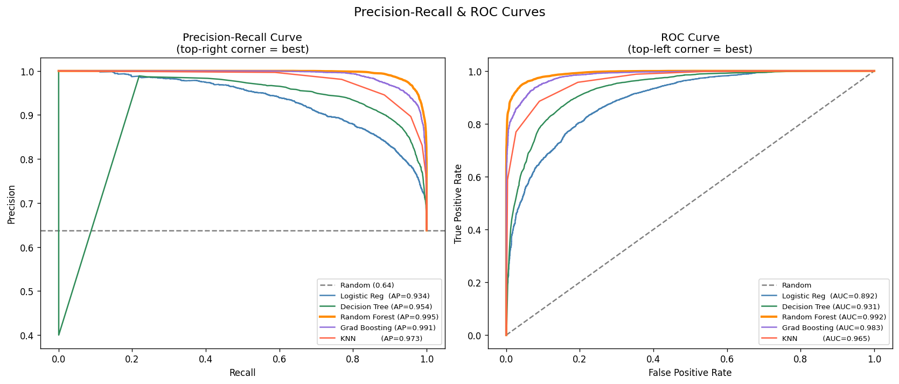
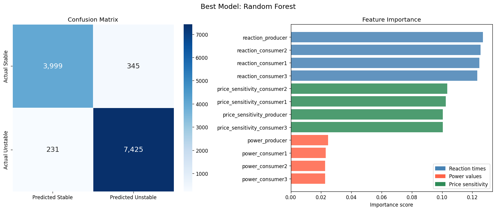
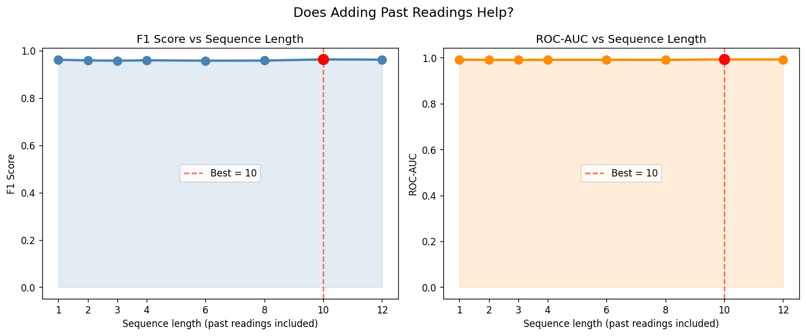

# Renewable Grid Stability Classifier

**SDG 7 — Affordable and Clean Energy**

A machine learning project that classifies smart grid power intervals as **stable** or **unstable** based on reaction times, power values, and price sensitivity of grid nodes.

---

## Project Overview

| Property | Details |
|---|---|
| **Goal** | Binary classification — stable vs unstable grid intervals |
| **Dataset** | UCI Smart Grid Stability (Augmented) — 60,000 samples |
| **Best Model** | Random Forest (F1 = 0.9627, ROC-AUC = 0.9918) |
| **Best Seq Length** | 10 past readings |
| **Language** | Python 3 |
| **Notebook** | `grid_stability.ipynb` |

---

## Project Structure

```
project/
│
├── grid_stability.ipynb               ← Main notebook (run this)
├── smart_grid_stability_augmented.csv ← Dataset (place here)
├── requirements.txt                   ← All dependencies
├── README.md                          ← This file
│
└── outputs/
    ├── 01_eda.png                     ← EDA charts
    ├── 02_model_comparison.png        ← All 5 models compared
    ├── 03_pr_roc_curves.png           ← Precision-Recall & ROC
    ├── 04_best_model.png              ← Confusion matrix + feature importance
    └── 05_sequence_tuning.png         ← Sequence length tuning results
```

---

## Installation

```bash
pip install -r requirements.txt
```

The `requirements.txt` includes:

```
pandas
numpy
matplotlib
seaborn
scikit-learn
jupyter
```

---

## How to Run

**Step 1** — Download the dataset from Kaggle:
> https://www.kaggle.com/datasets/pcbreviglieri/smart-grid-stability

**Step 2** — Place `smart_grid_stability_augmented.csv` in the same folder as the notebook

**Step 3** — Install dependencies:

```bash
pip install -r requirements.txt
```

**Step 4** — Open the notebook in VS Code and run each cell with **Shift + Enter**

```bash
# Or launch Jupyter in browser
jupyter notebook grid_stability.ipynb
```

---

## Dataset

**Source:** UCI Machine Learning Repository — Smart Grid Stability
**Size:** 60,000 rows × 14 columns
**Origin:** Based on the Decentral Smart Grid Control (DSGC) differential equations model published by Arzamasov et al.

### Column Names (renamed for clarity)

| Original | Renamed | Description |
|---|---|---|
| tau1–tau4 | reaction_producer, reaction_consumer1–3 | Reaction time of each grid node (seconds) |
| p1–p4 | power_producer, power_consumer1–3 | Power produced (+) or consumed (−) |
| g1–g4 | price_sensitivity_producer, price_sensitivity_consumer1–3 | Price elasticity of each node |
| stab | stability_score | Continuous stability margin (negative = unstable) |
| stabf | grid_status | **Target label** — "stable" or "unstable" |

### Class Distribution

| Class | Count | Percentage |
|---|---|---|
| Unstable | 38,280 | 63.8% |
| Stable | 21,720 | 36.2% |

> **Note:** `stability_score` is excluded from model inputs — it directly encodes the answer and using it would cause data leakage.

---

## Notebook Walkthrough

| Cell | Section | What it does |
|---|---|---|
| 1 | Imports | Load all required libraries |
| 2 | Load & Rename | Read CSV, rename columns to plain English |
| 3 | Validation | Check for missing values, duplicates, valid labels |
| 4 | EDA | 6 charts — distributions, correlations, class comparisons |
| 5 | Preprocessing | Train/test split (80/20) + StandardScaler |
| 6 | Train Models | Train all 5 models |
| 7 | Evaluate | Score every model on accuracy, F1, precision, recall, ROC-AUC |
| 8 | Model Comparison | Bar charts comparing all 5 models |
| 9 | PR & ROC Curves | Precision-Recall and ROC curves for all models |
| 10 | Best Model | Confusion matrix + feature importance |
| 11 | Seq Tuning | Test lag lengths 1–12, find optimal window |
| 12 | Summary | Final results table |

---

## Models Compared

| Model | How it works |
|---|---|
| **Logistic Regression** | Draws a straight boundary between stable and unstable |
| **Decision Tree** | Flowchart of yes/no questions on feature values |
| **Random Forest** | 100 decision trees vote — majority wins |
| **Gradient Boosting** | Trees built one by one, each fixing the last one's mistakes |
| **K-Nearest Neighbors** | Looks at the 7 most similar past rows and takes their label |

---

## Results

### Exploratory Data Analysis



---

### Model Comparison



### Model Leaderboard

| Model | Accuracy | F1 Score | Precision | Recall | ROC-AUC |
|---|---|---|---|---|---|
| **Random Forest** ⭐ | **95.20%** | **0.9627** | **0.9556** | **0.9698** | **0.9918** |
| Gradient Boosting | 93.26% | 0.9484 | 0.9266 | 0.9713 | 0.9835 |
| K-Nearest Neighbors | 90.21% | 0.9258 | 0.8966 | 0.9569 | 0.9650 |
| Decision Tree | 86.91% | 0.9005 | 0.8738 | 0.9289 | 0.9312 |
| Logistic Regression | 81.95% | 0.8620 | 0.8415 | 0.8835 | 0.8925 |

### Metric Guide

| Metric | Meaning |
|---|---|
| **Accuracy** | % of all predictions that were correct |
| **F1 Score** | Balance of Precision and Recall — best single number to compare models |
| **Precision** | Of all predicted *unstable*, how many really were? |
| **Recall** | Of all actual *unstable*, how many did we catch? |
| **ROC-AUC** | Overall ability to separate classes (1.0 = perfect, 0.5 = random) |

---

### Precision-Recall & ROC Curves



---

### Best Model — Confusion Matrix & Feature Importance



---

### Sequence Length Tuning



### Sequence Tuning Results

| Seq Length | Features | F1 Score | ROC-AUC |
|---|---|---|---|
| 1 | 12 | 0.9619 | 0.9914 |
| 2 | 16 | 0.9591 | 0.9906 |
| 6 | 32 | 0.9580 | 0.9909 |
| **10** ⭐ | **48** | **0.9633** | **0.9925** |
| 12 | 56 | 0.9624 | 0.9923 |

> Adding 10 past readings (lag features) gives the best F1 score. Beyond 10, extra history adds noise rather than signal.

---

## Key Findings

- **Random Forest** is the best model — it handles the non-linear relationships between reaction times and stability better than simpler models
- **reaction_producer** and **power_producer** are the most important features — the speed and power of the main producer node has the highest impact on grid stability
- **Logistic Regression** performs significantly worse (F1 = 0.86) — this confirms the stability boundary is non-linear and cannot be captured by a straight line
- **Sequence length = 10** gives the best results — the grid has a memory of ~2.5 hours (10 × 15-min intervals) that helps predict instability

---

## SDG 7 Connection

This project supports **SDG 7: Affordable and Clean Energy** by:

- Enabling **early detection** of grid instability before it causes blackouts
- Making renewable energy grids **safer and more reliable** as solar/wind input fluctuates
- Providing a **low-cost ML solution** that can run on standard hardware

---

## References

- Arzamasov, V., Böhm, K., & Jochem, P. (2018). *Towards Concise Models of Grid Stability*. IEEE PES Innovative Smart Grid Technologies Europe
- UCI ML Repository: https://archive.ics.uci.edu/dataset/471
- Kaggle Dataset: https://www.kaggle.com/datasets/pcbreviglieri/smart-grid-stability
